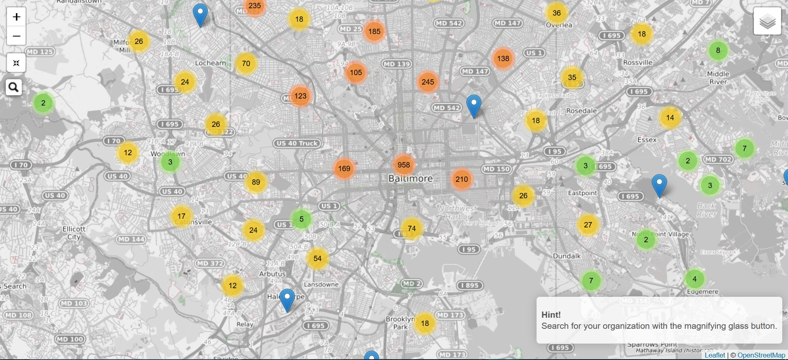
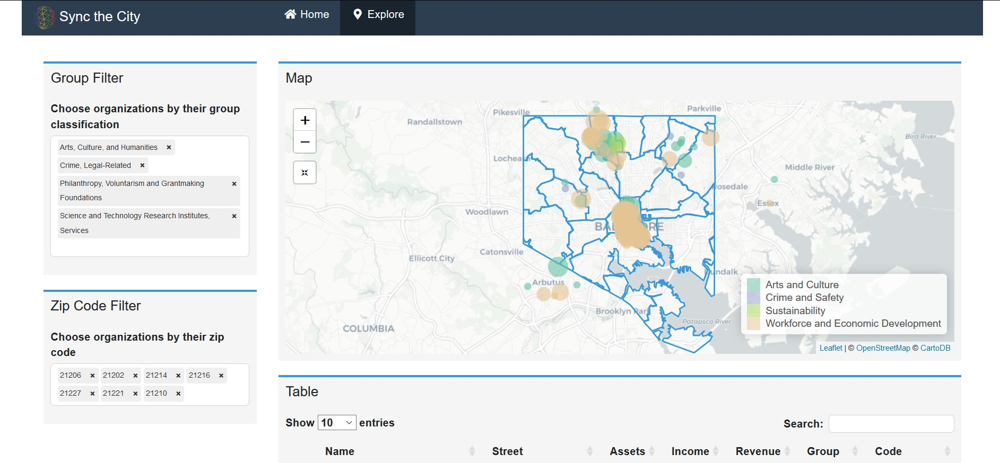

```{r setup, include=FALSE}
knitr::opts_chunk$set(echo = FALSE)
```

I have taken the past month or so to make progress on a [**Code for Baltimore**](http://www.codeforbaltimore.org/) project I've been working on since moving to Baltimore. As it stood we had created a [**static website**](https://syncthecity.github.io/) with a map using Leaflet to identify where nonprofit organizations are in Baltimore and what they do. This necessitates not just a map or other visualization but a more robust tool that allows for users to explore the data themselves. Although our static site could do some limited filtering we quickly outgrew its capabilities. The next logical step was to develop a [**web application.**](https://jason-bixon.shinyapps.io/sync_map/)



I was initially skeptical of my ability to implement this due to a recent attempt at Node.js which practically made me write off web development wholesale. My focus within data is decidedly not in development, but I also understand the power in building tools for data exploration. This may be an understatement, and to clarify I think empowering non-technical audiences to explore data in an intuitive way is one of the most challenging, rewarding, and important applications of data expertise in today's landscape. To that end, I am endlessly thankful for the R ecosystem which makes handling web frameworks and web development as painless as possible.       



Shiny is mature enough that it has implementations of tons of web components (selectize.js, DataTables, Leaflet) and is built on Bootstrap for easy frontend manipulation. To ground this back to why it's so useful, I could build a reactive application with intuitive inputs and outputs as well as a landing page to walk the user through the tool, all in a few hours and with no JavaScript experience. The cherry on top is I can do any data manipulation needed in a language best suited for it and easily deploy the tool once I'm satisfied.

I still have a lot to learn about such a powerful framework, but the most important takeaway to me is how empowering it felt to stand up a tool that can be shared, used, explored, and does not have many of the limitations that sharing an analysis comes with. 
