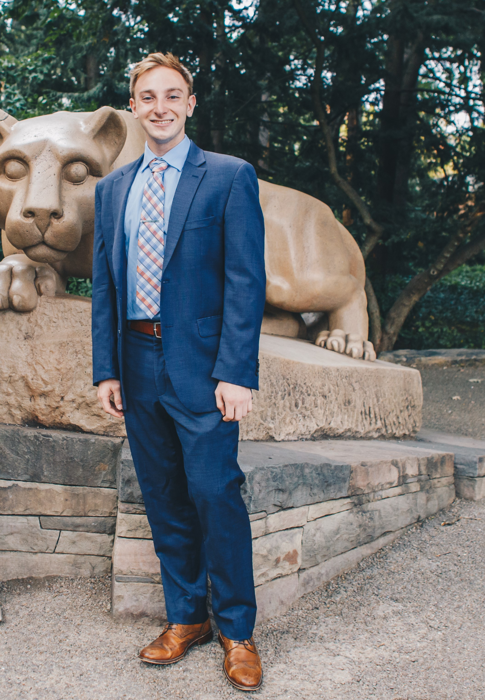

```{r setup, include=FALSE}
knitr::opts_chunk$set(echo = FALSE)
```

<style>
  .col2 {
    columns: 2 200px;         /* number of columns and width in pixels*/
    -webkit-columns: 2 200px; /* chrome, safari */
    -moz-columns: 2 200px;    /* firefox */
  }
  .col3 {
    columns: 3 100px;
    -webkit-columns: 3 100px;
    -moz-columns: 3 100px;
  }
</style>

<div class="col2">
{ width=90% }  


I am a recent graduate of The Pennsylvania State University where I studied Marketing and Sustainability Leadership.

I developed research experience as a Principal Investigator in the [**Pro-Environmental Action Lab**](https://www.swimlab.weebly.com). I currently work as a data analyst at [**Merkle Inc.**](https://www.merkleinc.com) in the [healthcare](https://www.merkleinc.com/industry-solutions/insurance-marketing) and [nonprofit](https://www.merkleinc.com/industry-solutions/nonprofit) verticals to develop analytical and predictive modeling capabilities for clients.
</div>

<br> 

This blog is built through the [**Distill**](https://rstudio.github.io/radix) framework for scientific and technical publishing. It doesn't give me all the fancy animations and options other platforms allow, but it allows the most flexibility for sharing interactive visualizations and analyses. I use a [**seperate website**](http://jasonbixon.netlify.com) to host a portfolio of my work. 
